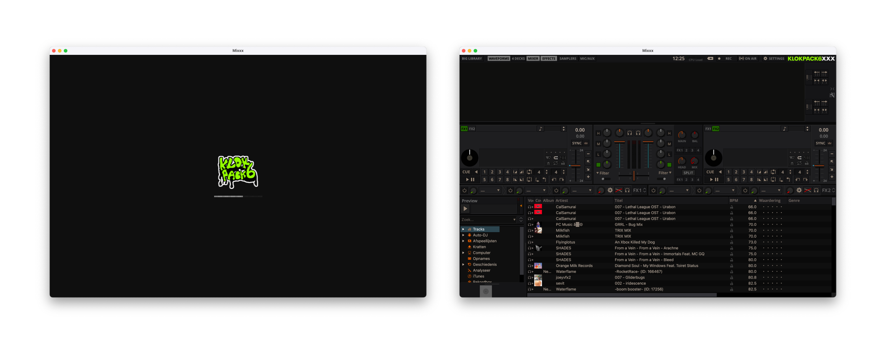
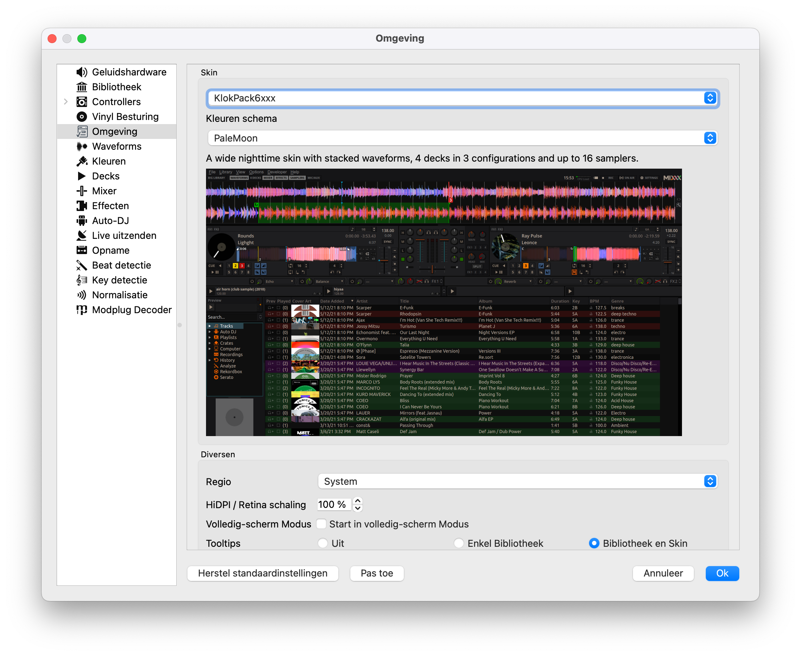

Based on the default PaleMoon skin (2.3)

# Installation

Copy the skin to the Mixxx skins folder:

**Linux**: `/usr/share/mixxx/skins/`  
**Windows**: `C:\Program Files\Mixxx\SKINS`  
**macOS**: `/Applications/Mixxx.app/Contents/Resources/skins`

Select the skin in the Mixxx preferences:

